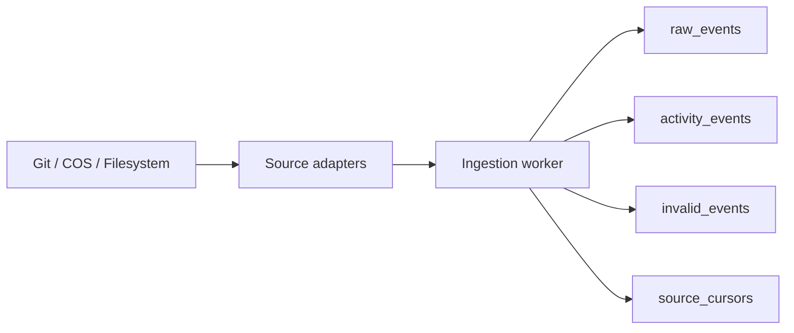

# Event Ingestion

## Overview
This feature adds the local-first ingestion pipeline for Founder Autopilot v1. The daemon now captures Git commit activity, structured COS events from local JSON/JSONL files, and focused filesystem modifications from configured watch paths, then persists both raw source payloads and normalized `ActivityEvent` rows in SQLite.

## Architecture
- `src/founder_autopilot/adapters.py`: source-specific collectors for Git, COS, and filesystem activity.
- `src/founder_autopilot/normalization.py`: timestamp normalization to UTC, deterministic IDs, signal inference, and schema validation.
- `src/founder_autopilot/ingestion.py`: worker that coordinates database persistence for source batches.
- `src/founder_autopilot/database.py`: raw-event dedupe, invalid-event quarantine, and cursor persistence.
- `src/founder_autopilot/daemon.py`: daemon loop wired to the real adapters.

## Data Flow

## Behavior
- Git events are collected from local repositories enclosing the configured watch paths.
- COS events are read from structured `.json`, `.jsonl`, or `.ndjson` files under `data/cos/`.
- Filesystem events are produced from modified files inside configured watch paths and respect excluded paths.
- Duplicate raw events are suppressed by a stable checksum keyed to `(project_id, source)`.
- Invalid normalized rows are quarantined in `invalid_events` with an error reason instead of stopping ingestion.
- Timestamps are normalized to UTC ISO-8601 before persistence so downstream ordering is consistent across sources.

## Verification
- `python -m unittest discover -s tests -v`
- `python -m pytest -q`
